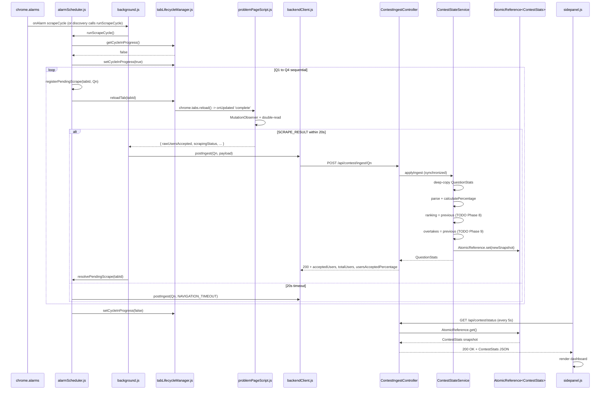

# System Flow — LeetCode Contest Monitor v5

## Process Map
Two processes communicate over HTTP on localhost:8080.

- **Extension** (Chrome MV3, JavaScript): DOM access, tab lifecycle, alarm scheduling, scraping
- **Backend** (Spring Boot, Java): parsing, calculation, ranking, overtake detection, state, REST API

## Extension Startup → Discovery → Config Registration

1. User enters contest URL in `options.html`
2. `options.js` saves URL to `chrome.storage.local`, sends `CONTEST_URL_SAVED` message (Note: this message triggers the discovery flow).
3. `background.js` receives message, calls `tabLifecycleManager.openOrReuseTab(contestUrl)`
4. `contestPageScript.js` runs in the contest homepage tab:
   - Queries Problem List for 4 entries
   - href-first extraction; click-and-capture fallback if needed
   - Returns `[{ questionNumber, problemName, problemUrl }]`
5. `background.js` calls `backendClient.postConfig({ contestUrl, questions: [...] })`
6. Backend: `ContestConfigController` receives POST, calls `ContestStateService.initializeContest()`
7. Backend: initializes empty `ContestStats` for Q1–Q4
8. `tabLifecycleManager` opens 4 background tabs (Q1–Q4); IDs persisted
9. `background.js` `sendResponse`s discovery success, then:
   - `registerMonitoringAlarm()` — `chrome.alarms` `scrapeCycle`, period from `monitoringIntervalMinutes` (default 5, clamp 1–60), delay 0
   - `runScrapeCycle()` immediately (does not wait for the first alarm tick)

## Interval Change (Phase 7)

1. User sets minutes on `options.html` and clicks Save
2. `options.js` persists `monitoringIntervalMinutes`; sends `MONITORING_INTERVAL_SAVED` (URL-only change still uses `CONTEST_URL_SAVED`)
3. `updateMonitoringInterval()` clears `scrapeCycle` and creates it with `delayInMinutes = period` — no bonus cycle
4. If monitoring has not started yet, only storage is updated; discovery will read it later

## Service Worker Restart (Phase 7)

1. Module load runs `recoverOrphanedCycleGuard()` — a dead mid-cycle SW left `cycleInProgress=true` with an empty pending map; clear it so the next alarm can run
2. `ensureMonitoringAlarm()` — if problem tabs are persisted, `monitoringStopped` is false, and `scrapeCycle` is missing (unpacked reload), re-register with the stored period. Do not call `runScrapeCycle()` on restart
3. `cycleInProgress` still skips a live overlapping tick

## Contest ENDED (Phase 7 hook; detection is Phase 11)

1. Phase 11 `ContestLifecycleService` marks `lifecycleState=ENDED` (ADR-006: 3 unchanged cycles) and the extension observes it via health/status (Phase 10)
2. Phase 11 sends `{ type: "CONTEST_ENDED" }` or calls `handleContestEnded()`
3. `stopMonitoringAlarm()` → `chrome.alarms.clear('scrapeCycle')` + `monitoringStopped=true`
4. `runScrapeCycle` / `onAlarm` refuse new cycles; SW restart will not recreate the alarm

## One Full Monitoring Cycle (Both Processes)

## Backend-Unreachable Path

1. `backendClient.postIngest()` → `TypeError: Failed to fetch` (connection refused)
2. `_setBackendUnreachable(true)` written to `chrome.storage.local`
3. Ingest attempt **dropped** (not queued)
4. `sidepanel.js` reads `backendUnreachable: true` → shows `⚠️ Backend not running` banner
5. Next alarm cycle: same behavior until backend is restarted
6. When backend restarts: first successful `checkHealth()` clears `backendUnreachable`
