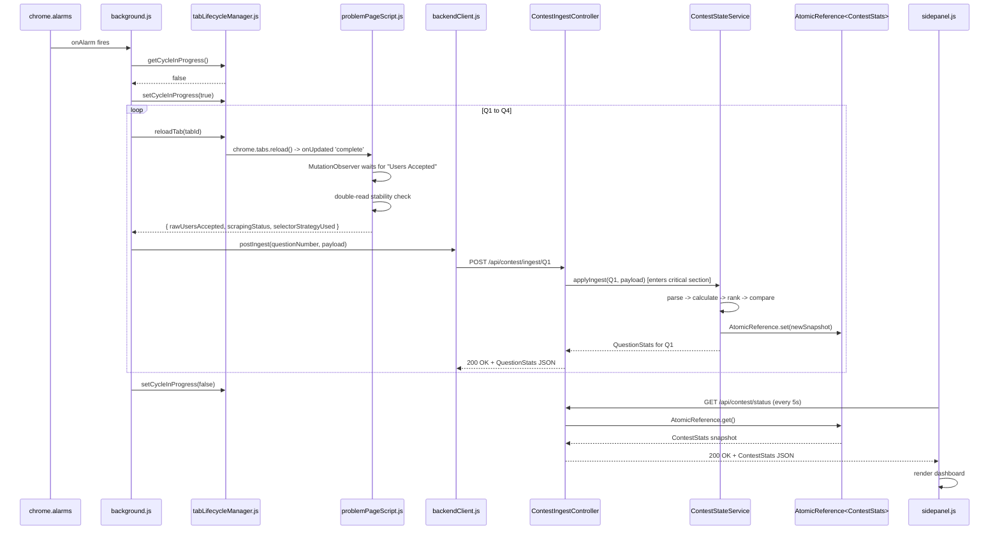

# System Flow — LeetCode Contest Monitor v5

## Process Map
Two processes communicate over HTTP on localhost:8080.

- **Extension** (Chrome MV3, JavaScript): DOM access, tab lifecycle, alarm scheduling, scraping
- **Backend** (Spring Boot, Java): parsing, calculation, ranking, overtake detection, state, REST API

## Extension Startup → Discovery → Config Registration

1. User enters contest URL in `options.html`
2. `options.js` saves URL to `chrome.storage.local`, sends `CONTEST_URL_SAVED` message (Note: this message triggers the discovery flow).
3. `background.js` receives message, calls `tabLifecycleManager.openOrReuseTab(contestUrl)`
4. `contestPageScript.js` runs in the contest homepage tab:
   - Queries Problem List for 4 entries
   - href-first extraction; click-and-capture fallback if needed
   - Returns `[{ questionNumber, problemName, problemUrl }]`
5. `background.js` calls `backendClient.postConfig({ contestUrl, questions: [...] })`
6. Backend: `ContestConfigController` receives POST, calls `ContestStateService.initializeContest()`
7. Backend: initializes empty `ContestStats` for Q1–Q4
8. `tabLifecycleManager` opens 4 background tabs (Q1–Q4)
9. `alarmScheduler` registers `chrome.alarms` with 5-minute period

## One Full Monitoring Cycle (Both Processes)

## Backend-Unreachable Path

1. `backendClient.postIngest()` → `TypeError: Failed to fetch` (connection refused)
2. `_setBackendUnreachable(true)` written to `chrome.storage.local`
3. Ingest attempt **dropped** (not queued)
4. `sidepanel.js` reads `backendUnreachable: true` → shows `⚠️ Backend not running` banner
5. Next alarm cycle: same behavior until backend is restarted
6. When backend restarts: first successful `checkHealth()` clears `backendUnreachable`
